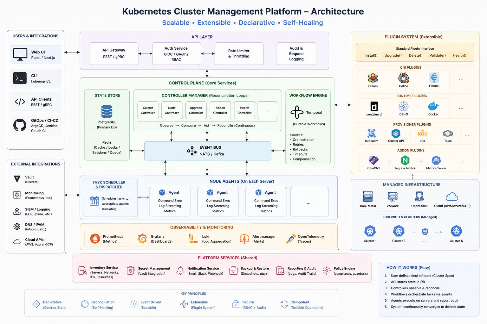

# ClusterPilot

> Kubernetes Cluster Lifecycle Platform

Manage Kubernetes clusters using declarative desired state, controllers, reconciliation loops, plugins and agents.

## Architecture

## Documentation

See the docs directory.

## Current Status

🚧 Under Development
